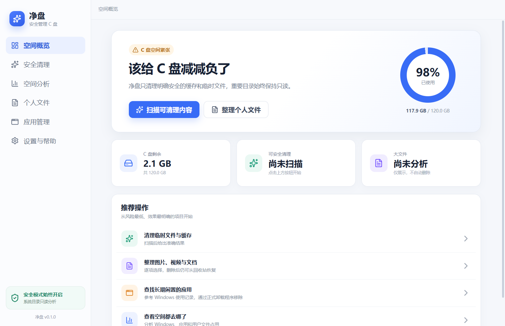

# 净盘

净盘是一款面向普通 Windows 用户的 C 盘空间管理工具。它把“系统垃圾清理”“空间分析”“个人文件整理”和“应用卸载”拆成清晰的独立流程，避免把所有内容混成一个危险的“一键删除”按钮。



## 已实现功能

- C 盘已用、剩余与总容量概览
- 白名单式安全清理：用户临时文件、Windows 临时文件、浏览器缓存、图形与网络缓存、崩溃报告、缩略图缓存、回收站
- 浏览器缓存覆盖 Edge、Chrome、Firefox、Brave、Chromium 与 Opera
- Windows、应用、用户目录和 ProgramData 空间分析
- 超过 500 MB 的大文件只读列表
- 图片、视频、Word、PPT、表格、PDF、压缩包和安装包分类
- 只整理位于 C 盘的个人目录，支持位置、90/180/365 天未修改、类型、名称与大小筛选
- 个人文件搜索、排序、分页与批量选择
- 选择的个人文件移入 Windows 回收站，不做永久删除
- 已安装应用搜索、估算大小、所在磁盘和闲置程度筛选
- 通过软件登记的正式卸载程序或 Windows 应用设置卸载
- 打开 Windows 官方“磁盘清理”和“存储感知”进行系统级深度清理

## 安全边界

净盘把安全边界放在主进程，而不是只依赖界面提示：

1. 清理请求只能提交内置类别 ID，不能提交任意文件路径。
2. 清理必须携带最近一次扫描生成的短期凭证，过期或不一致的项目会被拒绝。
3. 清理目录来自程序白名单；每个目录和文件都经过真实路径校验，目录连接点、符号链接和越界路径会被跳过。
4. 最近 24 小时的临时文件默认不清理，占用中、只读或无权限文件不会被强制修改或删除。
5. `Windows`、`Program Files`、`ProgramData` 等目录只做容量分析。
6. 个人文件只能从本次扫描结果中选择；删除前会复核文件身份、大小和修改时间，然后移入 Windows 回收站。
7. 应用卸载会移除注册表卸载命令中的静默参数，确保用户仍能看到并确认正式卸载向导。
8. Electron 渲染进程启用沙箱、上下文隔离、严格 IPC 白名单与 CSP，不加载远程页面。
9. 打包时关闭 Electron 的 Node 运行模式、`NODE_OPTIONS` 和调试参数，并启用 ASAR 完整性校验。

> Windows 并不为所有桌面软件提供准确的“最后使用时间”。净盘只把当前用户的 Windows 使用记录作为参考；“未发现记录”不代表软件从未使用。

## 本地开发

要求：

- Windows 10/11
- Node.js 22 或更高版本
- npm 10 或更高版本

```powershell
npm install
npm run dev
```

质量检查：

```powershell
npm run typecheck
npm test
npm run build
```

构建 Windows 安装包：

```powershell
npm run dist
```

构建结果位于 `release/`。

## 项目结构

```text
src/
  main/       Electron 主进程、扫描和清理安全逻辑
  preload/    最小化且类型安全的 IPC 桥
  renderer/   React 用户界面
  shared/     主进程与界面共享的数据类型
resources/    应用图标
scripts/      可重复生成资源的脚本
.github/      GitHub Actions 自动构建
```

## 发布到 GitHub

项目已包含 Windows 自动构建工作流。推送标签（例如 `v0.1.0`）后，GitHub Actions 会执行类型检查、测试、构建，并上传 Windows 安装包构建产物。

正式公开发布前，建议购买 Windows 代码签名证书并配置签名。未签名安装包会触发 Windows SmartScreen 提示，这不适合直接面向大量小白用户分发。

## 贡献与安全

- 贡献流程见 [CONTRIBUTING.md](CONTRIBUTING.md)
- 安全问题报告方式见 [SECURITY.md](SECURITY.md)
- 本项目使用 [MIT License](LICENSE)
